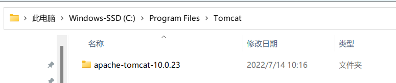
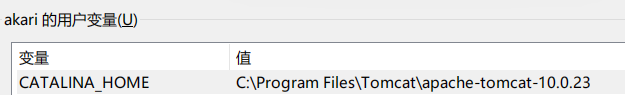
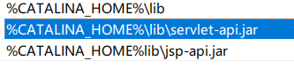

### 步骤

1. 解压tomcat

   
2. 添加环境变量

   

   PATH里

   
3. tomcat-users.xml里添加一下几句

   ```
   <role rolename="manager-gui"/>
   <role rolename="admin-gui"/>
   <user username="admin" password="admin" roles="admin-gui"/>
   <user username="tomcat" password="admin" roles="manager-gui"/>
   ```
4. 双击

   

在8080端口可以访问tomcat了
